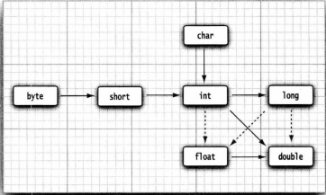

### 整形的表示方法

`int i=100_0000`  
`long i=100_0000L`  
`byte i=十六进制 0x11 二进制 0b11111111  八进制 0100`

### java byte 的数值表示范围 -128 - 127 以及强转的精度换算

```byte a=(byte) 0b01111111;```

### double打印 0.8999999999999999

double类型和int类型的整数部分表示范围相同都是30亿,超出的整数部分会四舍五入 int类型超出会溢出
```System.out.println(2.0-1.1)```

### java编译器对unicode的翻译

```
public class test {
    public static void main(String[] args) {
        String name = "沉默王二";
        // \u000d name="沉默王三";
        System.out.println(name);
    }
// \u000a is a newline
// look inside c:\users
}
```

### 局部变量优先使用基本类型

### 常量

只能赋值一次 习惯上用下划线和大写 final定义后不可以更改

```java
public class Constants {
    public static void main(String[] args) {
        final double CM_PER_INCH = 2.54;
        double paperWidth = 8.5;
        double paperHeight = 11;
        System.out.println("Paper size in centimeters: " + paperWidth * paperHeight * CM_PER_INCH
                + " by " + paperHeight * CM_PER_INCH);
    }
}
```  

### 外部使用常量 使用关键字 外部常量（可被其他类调用）public static final & 类常量 static final

```java
public class Constants {
    static final double CM_PER_INCH = 2.54;

    public static void main(String[] args) {
        double paperWidth = 8.5;
        double paperHeight = 11;
        System.out.println("Paper size in centimeters: " + paperWidth * paperHeight * CM_PER_INCH
                + " by " + paperHeight * CM_PER_INCH);
    }
}
```

### Class Math

Math.exact 用于整形算术 数值溢出会报错,直接使用算术符号运算会溢出不报错

### 数值的合法转换

  
实线可以直接转换不丢失精度 虚线会有精度丢失  
`int i = 123456789;`
`float f = i`
`1.23456792E8`  
在进行运算时会将小位数转换成大位数进行运算,char和byte运算时会转换成char因为char为union code而不是8bit

### 数值的强制转换(大位数转换成小位数)
double转int 会将小数位截断, 四舍五入需要使用 Math.round()
```
double x = 9.997;
int nx = (int)Math.round(x);
```
int转byte 超出的部分溢出  
boolean不要和任何类型进行强制转换,如果非要转换使用条件表达式 b?1:0

### 位运算符
- & ("and")`int forthBigFromRight = 4 & 0b1000`会将int转换成0b 进行位运算
- | ("or")
- ^ ("xor")  
- ~ ("not")  
- '>>'("右移")  
- '<<'("左移")  
- '>>>'("右移用0填充高位")   

### 字符串
- 使用String.substring截取字符串
```
String greeting = "Hello"
String s = greeting.substring(0,3);
//输出 下标为 0,1,2 的字符串  index<3 子串长度为3-0
````
- 任何Java对象都可以转换成字符串  
- 使用界定符分隔String拼接`String all = String.join("/","S","M")` 输出 S/M
- String对象的修改：修改不了,只能用类似substring的方法截取再重新拼接
- String字符串为不可变,只能修改String对象的变量让它引用另外个字符串,字符串处在堆中的共享区域,只有字符串字面量("123")会共享而通过+号或者substring操作得到的字符串并不共享
- 使用equals比较字符串
- 对字符串判空用 `str !=null && str.length()!=0`

- 码点(实际的字符数量)码点是指与一个编码表中的某个字符对应的代码值。在Unicode标准中，码点采用了十六进制书写，并加上前缀U+，例如U+0041就是拉丁字母A的码点。Unicode的码点可以分成17个代码平面。第一个代码平面称为基本多语言平面，包括码点从U+0000到U+FFFF的经典Unicode代码，其余的16个平面的码点为从U+10000到U+10FFFF，包括辅助字符。
- 代码单元（Code Unit）
  UTF-16编码采用不同长度的编码表示所有Unicode编码。在基本多语言平面中，每个字符用16位表示，称为代码单元。辅助字符编码为一对连续的代码单元。采用这种编码对表示的各个值落入基本多语言平面中未用的2048个值范围内，通常称为替代区域。这样设计十分巧妙，我们可以从中迅速知道一个代码单元时一个字符的编码，还是辅助字符的第一或第二部分。
  也就是说，在第一个代码平面中，我们并没有完全用掉每一个值，而是剩下一些值区间。那么我们可以组合这些没有用过的值区间来表示更大的码点，因为我们可以用的位数不再是16位，而是比16位要更长。具体怎样使用，就涉及到了编码算法。

```java
public class CodePoint {
    public static void main(String[] args) {
        //🚕wሴ你好 特殊字符和普通字符混用
        String greeting = "\uD83D\uDE95\u0077\u1234你好";
        System.out.println(greeting);
        //字符串长度 按16位来算
        int n = greeting.length();
        System.out.println(n);
        //求字符串实际字符长度(码点长度)
        int cpCount=greeting.codePointCount(0,greeting.length());
        System.out.println(cpCount);
        //获取第三个字符ሴ的下标位置(16位分隔)
        int index=greeting.offsetByCodePoints(0,2);
        System.out.println(index);
        //获取下标对应码点的十进制Unicode
        int cp = greeting.codePointAt(index);
        System.out.println(cp);
        System.out.println((char)cp);
        //charAt取的是🚕第二个代码单元
        char ch = greeting.charAt(1);
        System.out.println(ch);
    }
}
```
- 码点的遍历 使用Character.isSupplementaryCodePoint(cp) 判断是否是Unicode的补充字符
```
int cp = string.codePointAt(i);
if (Character.isSupplementaryCodePoint(cp))i+=2;
else i++;
```
或者将码点转换int数组
```
int[] codePoints=str.codePoint().toArray();
String str = new String(codePoints,0,codePoints.length)
```
- 一般使用StringBuilder来构建字符串拼接单线程效率高
- 读取输入  
```
Scanner in = new Scanner(System.in);
String name = in.nextLine();
 ```
- Console类提供了一个readPassword 让控制台输入的密码为加密的
- 格式化输出使用printf`System.out.printf("%8.2f",x);`  
printf可以使用多个参数`System.out.printf("Hello, %s. Next year,you'll be %d",name,age);`  
  
printf 表示时间格式用 %t(参数) 来表示  
$符号为索引,可以方便格式化参数代入(索引从1开始):  
`System.out.printf("%1$s %2$tc (%2$td %2$ty)","Due date:",new Date());`  
或者可以使用 %<t 表示使用前面一个时间参数:  
`System.out.printf("%s %tB %<te, %<tY","Due date:",new Date());`
- printf的格式语法 
  
- 读取文件也使用Scanner  
`Scanner in  = new  Scanner(Paht.of("myfile.txt"),StandardCharsets.UTF_8);`  
- 写入文件使用PrintWriter  
`PrintWriter out = new PrintWriter("myfile.txt",StandardCharsets.UTF_8);`

### 控制流程
- 可以在嵌套很深的循环中使用break跳出循环的外层,标记要在循环前并且跟一个冒号,标签可以用在任何语句,甚至可以用在if语句或者块语句
```    
public static void main(String[] args) {
        ret_data:
        for (int i = 0; i <10; i++) {
            System.out.println("i"+i);
            ret_data1:
            for (int j = 0; j <10 ; j++) {
                System.out.println("j"+j);
                break ret_data;
            }
        }
    }
```
### 大数
- 使用BigInteger 和BigDecimal 表示大整数或者进行任意精度的整数浮点运算
`BigInteger a = BigInteger.valueOf(100)`  
- 对于更大的数使用String 构造函数
`BigInteger a = BigInteger.valueOf("10000000000000000000")`
- RoundingMode.HALF_UP 为四舍五入

### 数组
- 声明: `int[] i;`或者`int i[];`
- 常量初始化:`int[] i =new int[100];`
- 变量初始化:`int[] i =new int[n];`
- 