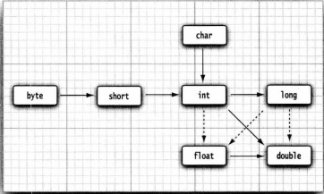
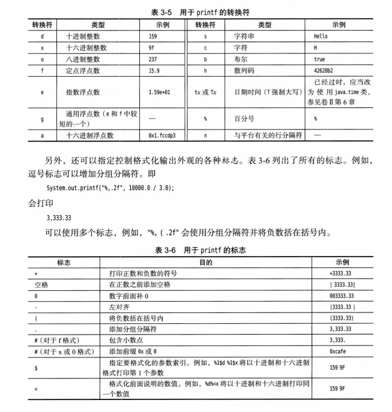
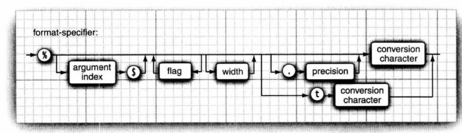

### 整形的表示方法

`int i=100_0000`  
`long i=100_0000L`  
`byte i=十六进制 0x11 二进制 0b11111111  八进制 0100`

### java byte 的数值表示范围 -128 - 127 以及强转的精度换算

```byte a=(byte) 0b01111111;```

### double打印 0.8999999999999999

double类型和int类型的整数部分表示范围相同都是30亿,超出的整数部分会四舍五入 int类型超出会溢出
```System.out.println(2.0-1.1)```

### java编译器对unicode的翻译

```
public class test {
    public static void main(String[] args) {
        String name = "沉默王二";
        // \u000d name="沉默王三";
        System.out.println(name);
    }
// \u000a is a newline
// look inside c:\users
}
```

### 局部变量优先使用基本类型

### 常量

只能赋值一次 习惯上用下划线和大写 final定义后不可以更改

```java
public class Constants {
    public static void main(String[] args) {
        final double CM_PER_INCH = 2.54;
        double paperWidth = 8.5;
        double paperHeight = 11;
        System.out.println("Paper size in centimeters: " + paperWidth * paperHeight * CM_PER_INCH
                + " by " + paperHeight * CM_PER_INCH);
    }
}
```  

### 外部使用常量 使用关键字 外部常量（可被其他类调用）public static final & 类常量 static final

```java
public class Constants {
    static final double CM_PER_INCH = 2.54;

    public static void main(String[] args) {
        double paperWidth = 8.5;
        double paperHeight = 11;
        System.out.println("Paper size in centimeters: " + paperWidth * paperHeight * CM_PER_INCH
                + " by " + paperHeight * CM_PER_INCH);
    }
}
```

### Class Math

Math.exact 用于整形算术 数值溢出会报错,直接使用算术符号运算会溢出不报错

### 数值的合法转换

  
实线可以直接转换不丢失精度 虚线会有精度丢失  
`int i = 123456789;`
`float f = i`
`1.23456792E8`  
在进行运算时会将小位数转换成大位数进行运算,char和byte运算时会转换成char因为char为union code而不是8bit

### 数值的强制转换(大位数转换成小位数)

double转int 会将小数位截断, 四舍五入需要使用 Math.round()

```
double x = 9.997;
int nx = (int)Math.round(x);
```

int转byte 超出的部分溢出  
boolean不要和任何类型进行强制转换,如果非要转换使用条件表达式 b?1:0

### 位运算符

- & ("and")`int forthBigFromRight = 4 & 0b1000`会将int转换成0b 进行位运算
- | ("or")
- ^ ("xor")
- ~ ("not")
- '>>'("右移")
- '<<'("左移")
- '>>>'("右移用0填充高位")

### 字符串

- 使用String.substring截取字符串

```
String greeting = "Hello"
String s = greeting.substring(0,3);
//输出 下标为 0,1,2 的字符串  index<3 子串长度为3-0
````

- 任何Java对象都可以转换成字符串
- 使用界定符分隔String拼接`String all = String.join("/","S","M")` 输出 S/M
- String对象的修改：修改不了,只能用类似substring的方法截取再重新拼接
- String字符串为不可变,只能修改String对象的变量让它引用另外个字符串,字符串处在堆中的共享区域,只有字符串字面量("123")会共享而通过+号或者substring操作得到的字符串并不共享
- 使用equals比较字符串
- 对字符串判空用 `str !=null && str.length()!=0`

- 码点(实际的字符数量)
  码点是指与一个编码表中的某个字符对应的代码值。在Unicode标准中,码点采用了十六进制书写,并加上前缀U+,例如U+0041就是拉丁字母A的码点。Unicode的码点可以分成17个代码平面。第一个代码平面称为基本多语言平面,包括码点从U+0000到U+FFFF的经典Unicode代码,其余的16个平面的码点为从U+10000到U+10FFFF,包括辅助字符。
- 代码单元（Code Unit）
  UTF-16编码采用不同长度的编码表示所有Unicode编码。在基本多语言平面中,每个字符用16位表示,称为代码单元。辅助字符编码为一对连续的代码单元。采用这种编码对表示的各个值落入基本多语言平面中未用的2048个值范围内,通常称为替代区域。这样设计十分巧妙,我们可以从中迅速知道一个代码单元时一个字符的编码,还是辅助字符的第一或第二部分。
  也就是说,在第一个代码平面中,我们并没有完全用掉每一个值,而是剩下一些值区间。那么我们可以组合这些没有用过的值区间来表示更大的码点,因为我们可以用的位数不再是16位,而是比16位要更长。具体怎样使用,就涉及到了编码算法。

```java
public class CodePoint {
    public static void main(String[] args) {
        //🚕wሴ你好 特殊字符和普通字符混用
        String greeting = "\uD83D\uDE95\u0077\u1234你好";
        System.out.println(greeting);
        //字符串长度 按16位来算
        int n = greeting.length();
        System.out.println(n);
        //求字符串实际字符长度(码点长度)
        int cpCount = greeting.codePointCount(0, greeting.length());
        System.out.println(cpCount);
        //获取第三个字符ሴ的下标位置(16位分隔)
        int index = greeting.offsetByCodePoints(0, 2);
        System.out.println(index);
        //获取下标对应码点的十进制Unicode
        int cp = greeting.codePointAt(index);
        System.out.println(cp);
        System.out.println((char) cp);
        //charAt取的是🚕第二个代码单元
        char ch = greeting.charAt(1);
        System.out.println(ch);
    }
}
```

- 码点的遍历 使用Character.isSupplementaryCodePoint(cp) 判断是否是Unicode的补充字符

```
int cp = string.codePointAt(i);
if (Character.isSupplementaryCodePoint(cp))i+=2;
else i++;
```

或者将码点转换int数组

```
int[] codePoints=str.codePoint().toArray();
String str = new String(codePoints,0,codePoints.length)
```

- 一般使用StringBuilder来构建字符串拼接单线程效率高
- 读取输入

```
Scanner in = new Scanner(System.in);
String name = in.nextLine();
 ```

- Console类提供了一个readPassword 让控制台输入的密码为加密的
- 格式化输出使用printf`System.out.printf("%8.2f",x);`  
  printf可以使用多个参数`System.out.printf("Hello, %s. Next year,you'll be %d",name,age);`  
    
  printf 表示时间格式用 %t(参数) 来表示  
  $符号为索引,可以方便格式化参数代入(索引从1开始):  
  `System.out.printf("%1$s %2$tc (%2$td %2$ty)","Due date:",new Date());`  
  或者可以使用 %<t 表示使用前面一个时间参数:  
  `System.out.printf("%s %tB %<te, %<tY","Due date:",new Date());`
- printf的格式语法
  
- 读取文件也使用Scanner  
  `Scanner in = new  Scanner(Paht.of("myfile.txt"),StandardCharsets.UTF_8);`
- 写入文件使用PrintWriter  
  `PrintWriter out = new PrintWriter("myfile.txt",StandardCharsets.UTF_8);`

### 控制流程

- 可以在嵌套很深的循环中使用break跳出循环的外层,标记要在循环前并且跟一个冒号,标签可以用在任何语句,甚至可以用在if语句或者块语句

```    
public static void main(String[] args) {
        ret_data:
        for (int i = 0; i <10; i++) {
            System.out.println("i"+i);
            ret_data1:
            for (int j = 0; j <10 ; j++) {
                System.out.println("j"+j);
                break ret_data;
            }
        }
    }
```

### 大数

- 使用BigInteger 和BigDecimal 表示大整数或者进行任意精度的整数浮点运算
  `BigInteger a = BigInteger.valueOf(100)`
- 对于更大的数使用String 构造函数
  `BigInteger a = BigInteger.valueOf("10000000000000000000")`
- RoundingMode.HALF_UP 为四舍五入

### 数组

- 声明: `int[] i;`或者`int i[];`
- 常量初始化:`int[] i =new int[100];`
- 变量初始化:`int[] i =new int[n];`
- 初始化简写形式:`int[] smallPrimes={2,3,5,7,11,13}`
- 匿名数组:`new int[]{2,3,4,5}`可以重新初始化一个数组而不用重新定义变量  
  `smallPrimes = new int[]{2,3,4,5}`等价于
  `int[] anonymous = {2,3,4,5};
  smallPrimes = anonymous;  
  `
- 数值型数组初始化时会将所有元素填充为0,boolean数组会初始化成false,对象类型数组会初始化成null
  `String[] strs= new String[10];`全部为null,如果需要为空串需要循环赋值成""
- 数组拷贝:  
  变量引用同一个数组:

```
int[] luckyNumbers=smallPrimes;
luckyNumbers[5]=100;
//smallPrimes[5]也为100
```

如果需要将值拷贝到另一个数组去,可以使用array.colne()或者Arrays.copyOf()
排序使用Arrays.sort(),Arrays.toString()可以显示所有数组元素

- 多维数组声明定义和一维数组一致,赋值需要多重循环取值,Java中实际上没有多维数组,为多个一维数组的集合
  例如 `int[][]arrays = new int[][];`中使用 array[i]来取到一个子数组,array.lenth 为行数(子数组个数),array[i].length为列数
- 多维数组使用Arrays.deepToString 来显示数组
- Java声明不规则数组例如杨辉三角形需要单行分配

```
int[][] arrays = new int[MAX][];
arrays[i] = new int[i+1];
```

### 基元变量、基元数组、String对象、String对象数组、pojo对象、pojo对象数组 之间引用关系

```
int i = 1;
int j = i;
```

此时改变i或者j的值
基元变量:可能在常量区中,j不会随着i的改变而改变
基元数组:Java里面基元数组表示为指针,i和j的地址相同
String对象:不是堆中地址,可能在常量区中,j不会随着i的改变而改变
String对象数组:在堆中,i与j地址相同
People对象:地址相同
People对象数组:地址相同

### 类与对象

- 构造器方法名称与类名称相同, 构造一个Date对象, 需要在构造器前面加上new
  `new Date();`
- `Date deadline;`定义了一个对象变量,但是它不是一个对象,没有引用任何对象.  
  可以初始化这个变量,或者让它引用一个已有的对象:  
  `deadline = new Date();`  
  `deadline = birthday;`
  对象变量并没有实际包含一个对象,只是引用一个对象,new 操作符返回的就是一个引用,
  可以显示的将对象变量设置成null,表示这个对象变量目前没有引用任何对象.

### Date与 LocalDate

- Date用于表示时间点

- LocalDate用于表示日期
  LocalDate 使用静态工厂方法 LocalDate.now() 来调用构造器表示当前时间
  LocalDate.of(1999,12,31) 表示定义特定时期
  使用静态私有工厂方法的好处可以保证引用的唯一性,代码中赋值时不容易出现相同引用
  类似代码如下:
  私有的构造器

```  
  private LocalDate(int year, int month, int dayOfMonth) {
    this.year = year;
    this.month = (short) month;
    this.day = (short) dayOfMonth;
  }
```

通过类中的静态类调用private的构造器

```  
  public static LocalTime of(int hour, int minute, int second) {
    HOUR_OF_DAY.checkValidValue(hour);
    if ((minute | second) == 0) {
      return HOURS[hour];  // for performance
    }
    MINUTE_OF_HOUR.checkValidValue(minute);
    SECOND_OF_MINUTE.checkValidValue(second);
    return new LocalTime(hour, minute, second, 0);
  }
```

并且LocalDate 是没有更改器方法,而Date()方法是有setTime()来更改时间,Date对象
是可变的,破坏了封装性

### 更改器方法和访问器方法

`localdate.plusDays(1000);` 是一个访问器方法会新生成一个LocalDate对象不会对原来对象进行修改
`gregorianCalendar.add(Calendar.DAY_OF_MONTH,1000); `会在gregorianCalendar基础上更改对象的值,是更改器方法
java中访问器方法与更改器方法在语法上面没有明显区别

### POJO

实例字段通常为private , 方法以及构造器通常为public

- 构造器与类同名
- 每个类可以有一个以上的构造器
- 构造器可以有0个、1个或多个参数
- 构造器没有返回
- 构造器总是伴随着new操作符一起调用

### var

可以从变量的初始值推导出来它们的类型,var关键字只能使用在方法中的局部变量,参数和字段的类型必须声明

```
var harry = new Employee("harry",50000,2012,12,31);
var i = 10;
var l = 10L;
var d= 10.0;
```

### null值处理

Object object = null ;表示对象没有引用任何对象
当对null对象调用方法会产生NullPointerException异常
`Objects.requireNonNullElse()`
`Objects.requireNonNull()`

### 隐式参数与显式参数

```   
 public void raiseSalary (double byPercent){
        double raise = salary*byPercent/100;
        salary+=raise;
    }
```

函数声明中括号内的值为显示参数 byPercent  
隐式参数一般为类的实例字段可以改为如下方法:

```   
 public void raiseSalary (double byPercent){
        double raise = this.salary*byPercent/100;
        this.salary+=raise;
    }
```

## 访问权限

- 基于类的访问权限: 一个方法可以访问所属类的所有对象的私有数据,所有数据字段都应该设计成私有的.
- 私有方法: 当一个类中方法需要拆分成多个辅助方法时,可以将方法声明成 private 类型
- final实例字段:
  `private final String name = "123"`
  必须保证final修饰的字段在构造器执行后,这个字段的值已经设置,并且以后不能修改这个值.
  对于类型为基本类型或者不可变类的实例字段尤其有用(如果类中的所有方法都不会改变其对象,这样的类就是不可变类.例如 String类就是不可变的.)
  对于可变类,使用final修饰符可以让实例对象不会再引用另外一个对象,但是不能阻止对象对自身更改:

```
private final StringBuilder sb;
public Employee(){
  this.sb = new StringBuilder();
}
public void changeSb(){
  this.sb.append(LocalDate.now());
}
```

此处 StringBuilder 类有更新器方法 final 无法限制其改变自身

### 静态字段与静态方法

- 静态字段(static):

```java
class Employee {
    private static int nextId = 1;
    private int id;
}
```

每个Employee实例都有自己的id,但是所有实例将共享一个nextId字段。
即使没有Employee实例对象,静态字段nextId也存在。
可以使用getter方法取这个值

- 静态常量(static final):

```java
public class Math {
    public static final double PI = 3.141592654;
}
```

可以通过Math.PI 来访问静态常量,如果省略 static ,PI就变成了Math的实例字段,
需要通过Math的一个实例来访问PI,并且每个Math对象都有它自己的一个PI副本 。
PI可以声明成public
因为 PI已经声明成了final,不允许重新赋值

### final 和 static的组合 (总结) :

当实例字段上只有 final 时,可以在构造方法中初始化值
(可以用this取值,因为依然是实例字段)或者直接在字段后赋值,
每个实例的final变量都可以有不同的值。
而使用 static final 时,只能在类变量(静态变量)后面赋值,
构造方法中是赋值不了的。public static final 既可以通过类名.访问,
也可以通过实例访问,不过一般会使用类名访问。

- 静态方法:
  静态方法不是在对象上执行的方法,并不使用任何实例字段(没有this参数的方法),
  但是静态方法可以访问静态字段(如果有需要普通方法也可以访问静态字段不过容易混淆)。
  main方法也是一个静态方法
  静态方法访问普通方法需要实例化类,普通方法可以直接访问静态方法

```java
public class Sample {
    private static String a = "123";
    public static final String b = "234";

    public static void getab() {
        System.out.println(a);
        System.out.println(b);
    }

    public void getab() {
        System.out.println(a);
        System.out.println(b);
    }
} 
```

### 工厂方法

```
  NumberFormat currencyFormatter = NumberFormat.getCurrencyInstance();
  NumberFormat percentFormatter = NumberFormat.getPercentInstance();
  System.out.println(currencyFormatter.format(0.1));
  System.out.println(percentFormatter.format(0.1));
```

- 工厂方法的常见用途:

1. 因为构造方法不可以按自定义名称来定义,必须和类名相同,如果需要自定义生成实例方法需要用工厂方法
2.
3. 构造器返回的就是类的引用,无法改变构造对象的类型,工厂方法可以返回子类

### 方法参数

- Java语言中参数传递的是拷贝，基本类型传递的是值的拷贝，引用类型传递的是内存地址的拷贝。
  当一个对象实例作为一个参数被传递到方法中，参数的值就是对该对象的内存地址。
  所以Java的参数传递都是值传递，而没有引用传递！
  即使是引用类型的参数，也是值传递，而这个值，实际上是引用对象的引用地址。
- 方法不能修改基本数据类型的参数(数值或者布尔)
- 方法可以改变对象参数的状态(可以改变对象的实例字段)
- 方法不能让一个对象参数引用一个新的对象(在方法结束时候新对象会被丢弃),在使用新对象时候不会对原来的对象进行改变

### 字段初始化，无参构造器，显示字段初始化，参数名的定义 ，this 关键字的其他用法

- 如果在构造器中没有显示的为字段设置初值,数值为0、布尔值为false、对象引用为null
- 如果自定义构造器是有参的，那么new 的时候不提供参数是不合法的。
- 如果一个类的所有构造器都希望把某个字段设置成同一个值。

```
class Employee{
  private String name = "";
}
```

初始值不一定是常量值，也可以是使用方法调用。

```
class Student{
    public static int nextId;
    private int id = assignId();
    private int assignId() {
        int r = nextId;
        nextId++;
        return r;
    }
}
```

- 参数变量会屏蔽同名的实例字段，但是可以使用this.来访问实例字段。

```
public Employee (String name ,double salary){
  this.name = name ;
  this.salary = salary;
}
```

- 把this关键字放在构造函数中的第一条 this(...)，这个构造器会调用另一个构造器。
  这样对公共的构造器代码只需要编写一次即可

```
public Employee(double s){
  //会调用参数为 Employee(String , double)的构造方法。
  this("Employee #" + nextId , s );
  nextId++;
}
```

### 初始化块

- 可以在构造器、声明、初始化块 中对实例字段进行赋值。只要构造类的对象，初始化块就会被执行。
  (无论使用哪种构造方法，都会执行，而且会比构造方法先执行)

```java

class Employee {
    private static int nextId;

    private int id;
    private String name;
    private double salary;

    {
        id = nextId;
        nextId++;
    }
}
```

### 字段初始化顺序

1. 如果构造器第一行调用了另一个构造器，先执行另一个
2. 将所有字段置成默认值(0,false,null)
3. 按字段声明的顺序执行所有字段的初始化方法和初始化块(块和字段是同级的，谁在前面谁先初始化)
4. 执行构造器主体方法

如果类的静态字段需要复杂的初始化代码，可以使用静态代码块。

```
private static int nextId = 1 ;

static{
  var generator = new Readom();
  nextId = generator.nextInt(10000);
}
```

静态代码块、静态字段、静态方法 都是属于类的，静态代码块 和 静态字段不是在类实例化的时候初始化和运行
而是类刚被加载就开始运行了。静态代码块、静态字段 与 实例字段一样，都是按声明的顺序依次加载。
有种特殊情况就是构造方法调用其他构造方法的情况。这时 检测到调用了其他构造方法，会将
当前方法中的参数书传入到另外一个构造方法中，会生成局部变量，会导致代码块中的赋值没有效果。
所以 构造调用构造 传输的参数尽量不要使用静态字段。
例如：

```    
private static  int nextId;
private int id;
private String name = "";
private double salary;
{
    var generator = new Random();
    nextId = generator.nextInt(10000);
    System.out.println(nextId);
}
{
    id = nextId;
    nextId++;
}
public EmployeeT(String name,double salary){
    this.name=name;
    this.salary=salary;
}
//调用  EmployeeT(String name,double salary)
public EmployeeT(double salary){
  this("Employee #"+nextId,salary);
}
```

### 包

- 如果 java.util.Date 和 java.sql.Date 两个类都要使用在代码中需要使用完全限定名
- 对于频繁使用的静态方法可 以使用静态导入 `import static ` 比如Math 中全部为静态方法，在工具类中也可以使用，增加可读性
- 类路径：
  如果虚拟机要加载class文件会从类路径开始查找，虚拟机查找顺序为
  1.javaApi
  2.基目录(class path): /home/user/classdir
  3.当前目录(.)
  4.第三方jar包:/home/user/archives/archive.jar

编译器查找:
如果未指定，使用的是类似 `import java.util.*;`
查看所有的import指令，确定其中是否包含这个类首先尝试查找
java.lang.Employee ，然后就是 java.util.Employee
